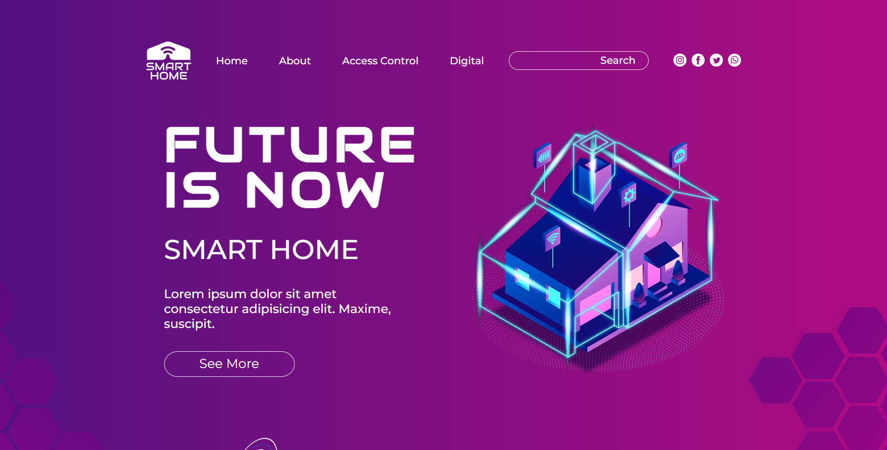

# "Smart Home" markup training :muscle:


Example of markup training    
The THIRD markup of mine, a little better than the previous ones    

----
## Mistakes of my [very first](https://github.com/IvanPostarnak/travel-blog-markup-training) try :secret:
* a lot of repetitions of CSS code
* not using BEM methodology of CSS
* not using any of CSS preprocessors
* was not using semantic tags of HTML at all
* it wasn't checked in every browser it should've been checked in
* didn't set copyrights, author or description meta
* was not using power of inheritance

----
## In the [previous (second)](https://github.com/IvanPostarnak/pure-lite-markup-training) attempt there were such mistakes as :ideograph_advantage:
* still a lot of repetitions of CSS code 
* not using any of CSS preprocessors
* not cross-browser support
    
----
## Things I've achieved in markup by this moment:
- [x] I've added semantic tags of HTML, such as `<header>`, `<nav>`, `<section>`, `<article>`, `<aside>`, `<footer>` and `<address>`
- [x] using only one of each `<h1> - <h6>` headers (with one exception)
- [x] add `<meta name="author">` and `<meta name="description">`, as well as commented copyrights into html file
- [x] using `oblique` isntead of `italic`
- [x] using `webp` image format instead of `png` in the previous examples (wanted to use `svg` as well)
- [x] set font-size relatively, based on the `:root { font-size: 10px; }` (math with 10px is much easier than with 14px or 16px)
- [x] started using `SCSS` preprocessor of CSS, including `$preprocessor-directive` and `@import './relative/path/scss-module-name'`
- [x] organize modules and project structure according to the BEM methodology (+-)
- [x] started using `<a>` tag insted of `<button>` one for elements such as "See more", "Read More" etc
- [x] partly achieved full cross-browser support
    - Google Chrome :heavy_check_mark:
    - Mozilla Firefox :heavy_check_mark:
    - Microsoft Edge :heavy_check_mark:
    - Internet Explorer :x:
    - Safari :grey_question:

```CSS
  -webkit-box-sizing: border-box;
  -moz-box-sizing: border-box;
  -ms-box-sizing: border-box;
  -o-box-sizing: border-box;
  box-sizing: border-box;
```
----
## New things to improve: :exclamation:
- [ ] don't forget about `<main>` semantic tag
- [ ] use `svg` format for icons
- [ ] add `.gitignore` and ignore .css.map building files
- [ ] check mixins and predicate operators of SCSS
- [ ] use `<noscript>` html tag

----
## Contacts
* [Vkontakte](https://vk.com/ivanpostarnak)
* ivan.postarnak.s@gmail.com